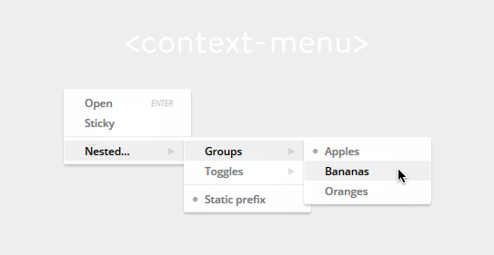

![Built With Stencil](https://img.shields.io/badge/-Built%20With%20Stencil-16161d.svg?logo=data%3Aimage%2Fsvg%2Bxml%3Bbase64%2CPD94bWwgdmVyc2lvbj0iMS4wIiBlbmNvZGluZz0idXRmLTgiPz4KPCEtLSBHZW5lcmF0b3I6IEFkb2JlIElsbHVzdHJhdG9yIDE5LjIuMSwgU1ZHIEV4cG9ydCBQbHVnLUluIC4gU1ZHIFZlcnNpb246IDYuMDAgQnVpbGQgMCkgIC0tPgo8c3ZnIHZlcnNpb249IjEuMSIgaWQ9IkxheWVyXzEiIHhtbG5zPSJodHRwOi8vd3d3LnczLm9yZy8yMDAwL3N2ZyIgeG1sbnM6eGxpbms9Imh0dHA6Ly93d3cudzMub3JnLzE5OTkveGxpbmsiIHg9IjBweCIgeT0iMHB4IgoJIHZpZXdCb3g9IjAgMCA1MTIgNTEyIiBzdHlsZT0iZW5hYmxlLWJhY2tncm91bmQ6bmV3IDAgMCA1MTIgNTEyOyIgeG1sOnNwYWNlPSJwcmVzZXJ2ZSI%2BCjxzdHlsZSB0eXBlPSJ0ZXh0L2NzcyI%2BCgkuc3Qwe2ZpbGw6I0ZGRkZGRjt9Cjwvc3R5bGU%2BCjxwYXRoIGNsYXNzPSJzdDAiIGQ9Ik00MjQuNywzNzMuOWMwLDM3LjYtNTUuMSw2OC42LTkyLjcsNjguNkgxODAuNGMtMzcuOSwwLTkyLjctMzAuNy05Mi43LTY4LjZ2LTMuNmgzMzYuOVYzNzMuOXoiLz4KPHBhdGggY2xhc3M9InN0MCIgZD0iTTQyNC43LDI5Mi4xSDE4MC40Yy0zNy42LDAtOTIuNy0zMS05Mi43LTY4LjZ2LTMuNkgzMzJjMzcuNiwwLDkyLjcsMzEsOTIuNyw2OC42VjI5Mi4xeiIvPgo8cGF0aCBjbGFzcz0ic3QwIiBkPSJNNDI0LjcsMTQxLjdIODcuN3YtMy42YzAtMzcuNiw1NC44LTY4LjYsOTIuNy02OC42SDMzMmMzNy45LDAsOTIuNywzMC43LDkyLjcsNjguNlYxNDEuN3oiLz4KPC9zdmc%2BCg%3D%3D&colorA=16161d&style=flat-square)

# context-menu

Multi-level context menu component with lists and toggles.

## Example

    <context-menu>
        
Open<aside class="uc">enter</aside>

        
Sticky

        

        

            Nested menu...
            <context-menu>
                

                    Groups
                    <context-menu>
                        
Apples

                        
Bananas

                        
Oranges

                    </context-menu>
                

                

                    Toggles
                    <context-menu>
                        
Basic toggle

                        
Extended toggle

                    </context-menu>
                

                

                
Static prefix

            </context-menu>
        

    </context-menu>

<!-- Auto Generated Below -->

## Properties

| Property            | Attribute            | Description                                                                                                                       | Type     |
| ------------------- | -------------------- | --------------------------------------------------------------------------------------------------------------------------------- | -------- |
| `horizontalOverlap` | `horizontal-overlap` | Overlapping of child <> parent menus in pixel (default `8`)                                                                       | `number` |
| `zIndex`            | `z-index`            | Sets the css attribute z-index to a custom value. Default is `100` whereas every child increments the value of its parent by one. | `number` |

## Events

| Event    | Description                                                       |
| -------- | ----------------------------------------------------------------- |
| `hide`   | Fires when the menu is closed                                     |
| `select` | Fires on `mouse down` of any row with the attribute `data-group`  |
| `show`   | Fires when the menu is opened                                     |
| `toggle` | Fires on `mouse down` of any row with the attribute `data-toggle` |

## Methods

| Method  | Description |
| ------- | ----------- |
| `close` | Close menu  |
| `open`  | Open menu   |

----------------------------------------------

*Built with [StencilJS](https://stenciljs.com/)*
